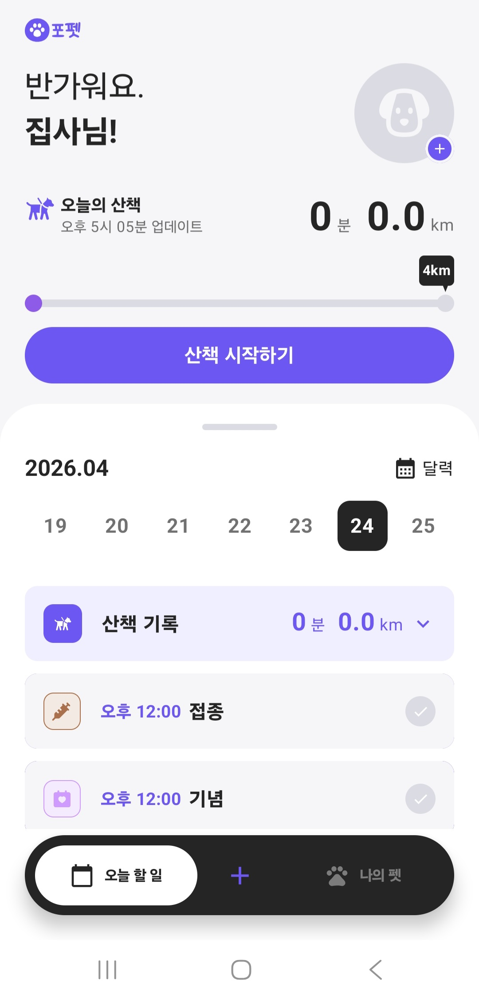
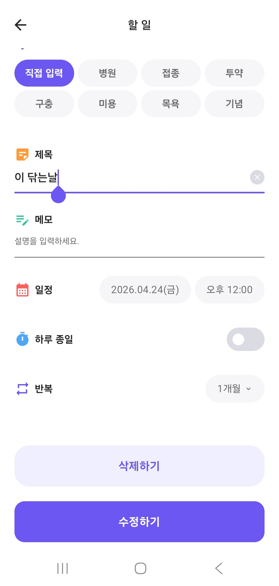
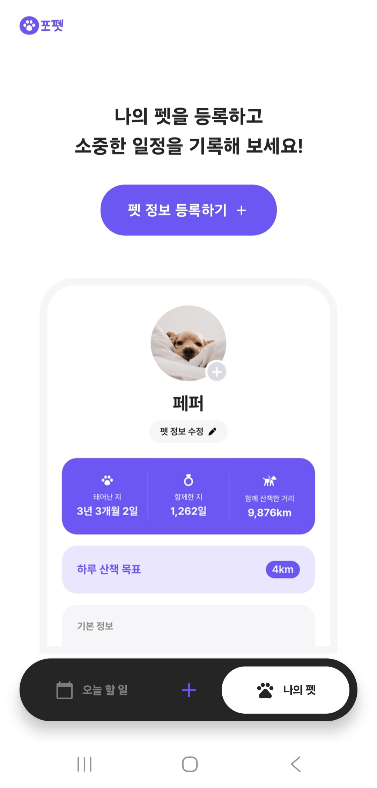
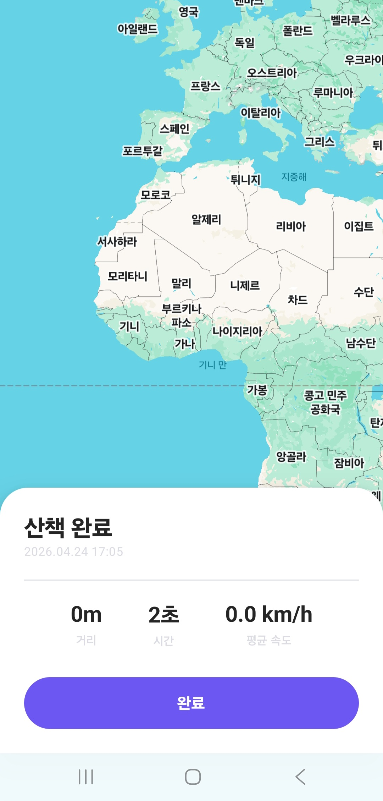
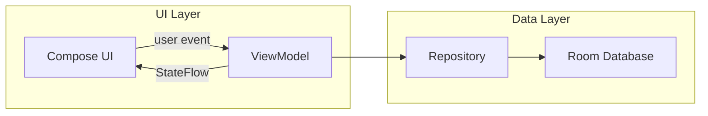

<div align="center">
  <h1>ForPet</h1>
  <p>
    반려동물의 일정, 산책, 프로필 관리를 하나의 흐름으로 연결한<br />
    <strong>Kotlin 기반 Android 개인 프로젝트</strong>
  </p>
  <p>
    
    
    
  </p>
</div>

## 프로젝트 개요

ForPet은 반려동물과 함께하는 일상 데이터를 기록하고 관리하는 Android 앱입니다.
오늘의 산책 상태를 확인하고, 병원·접종·투약·기념일 같은 일정을 캘린더에 기록하며, 반려동물의 프로필과 산책 목표를 관리할 수 있도록 구성했습니다.

기능을 화면별로 나열하기보다 홈, 일정, 산책, 나의 펫 화면이 자연스럽게 이어지는 제품 흐름을 목표로 설계했습니다.

## 주요 화면

<table>
  <tr>
    <td align="center"><strong>오늘 할 일</strong></td>
    <td align="center"><strong>일정 작성</strong></td>
    <td align="center"><strong>나의 펫</strong></td>
    <td align="center"><strong>산책 결과</strong></td>
  </tr>
  <tr>
    <td></td>
    <td></td>
    <td></td>
    <td></td>
  </tr>
</table>

## 앱 구조

프로젝트는 Android 공식 앱 아키텍처 가이드의 계층 구조를 바탕으로 구성했습니다.
UI는 Jetpack Compose로 작성하고, 화면 상태는 ViewModel에서 `StateFlow`로 노출합니다.
Compose 화면은 상태를 관찰해 렌더링하고, 사용자 이벤트는 ViewModel을 통해 데이터 계층으로 전달됩니다.



## 모듈 구조

앱 진입점, 공통 계층, 기능 계층, 빌드 설정을 분리한 멀티 모듈 구조입니다.
기능별 화면은 `feature` 모듈에 두고, 여러 기능에서 공유하는 모델, 데이터, UI 컴포넌트, 디자인 시스템은 `core` 모듈로 분리했습니다.

```text
build-logic
  convention

app
  application entry point

core
  model
  data
  database
  navigation
  designsystem
  ui
  background

feature
  home
  calendar
  schedule
  walk
  mypet
```

## 빌드 구성

빌드 설정은 `build-logic`의 convention plugin으로 공통화했습니다.
각 모듈은 필요한 convention plugin만 적용하고, Android/Compose/Hilt/Room 관련 반복 설정은 빌드 로직에 모아 관리합니다.

의존성 버전은 Gradle Version Catalog로 관리하고, Room과 Hilt의 코드 생성은 KSP 기반으로 구성했습니다.

## 사용 기술

| 영역 | 내용 |
| --- | --- |
| Language | Kotlin |
| UI | Jetpack Compose, Material 3 |
| Architecture | Android App Architecture, ViewModel, StateFlow |
| Data | Repository, Room |
| DI | Hilt |
| Navigation | Navigation Compose |
| Map & Location | Google Maps Compose, Play Services Location |
| Build | Gradle Convention Plugin, Version Catalog, KSP |

## 실행 방법

### Requirements

- Android Studio
- JDK 17
- Android SDK 26+

### Google Maps Key

`local.properties`에 Google Maps API Key를 추가합니다.

```properties
GOOGLE_MAPS_API_KEY=YOUR_GOOGLE_MAPS_API_KEY
```

### Build

```bash
./gradlew :app:assembleDebug
```

## 프로젝트 메모

ForPet은 반려동물의 하루 루틴을 관리하는 개인 프로젝트입니다.
면접 참고자료로는 화면 구현 자체보다, Compose 기반 화면 구성, ViewModel 상태 관리, 멀티 모듈 구조, build-logic 기반 빌드 설정을 중심으로 봐주시면 좋습니다.
